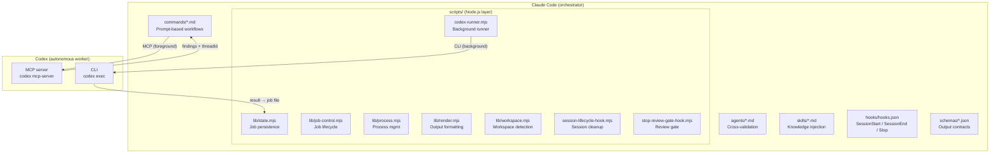
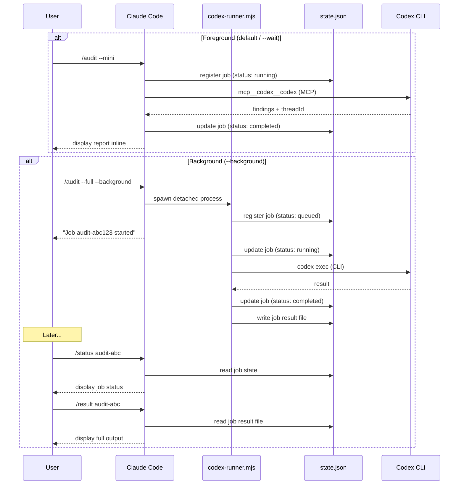
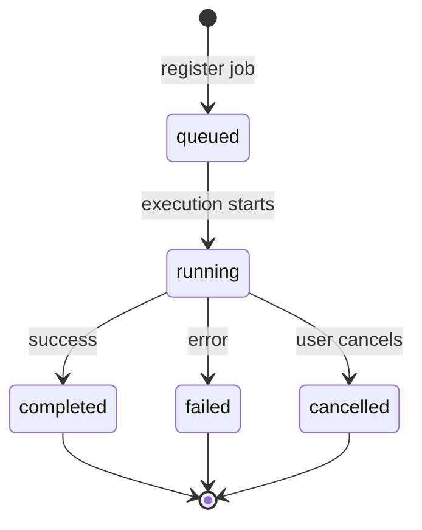
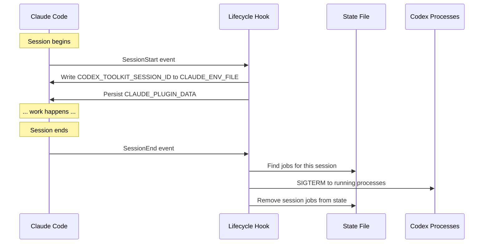
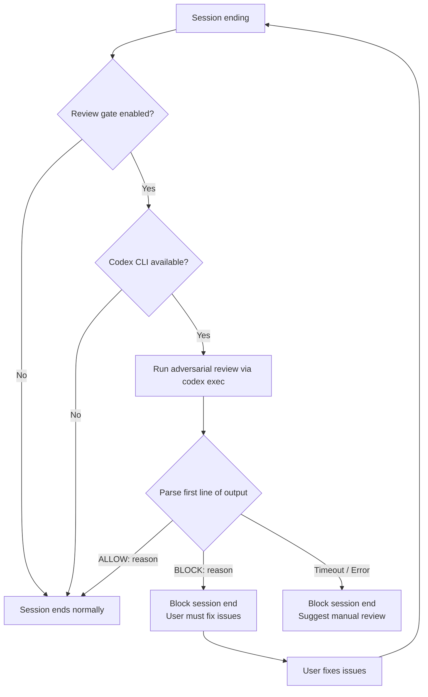
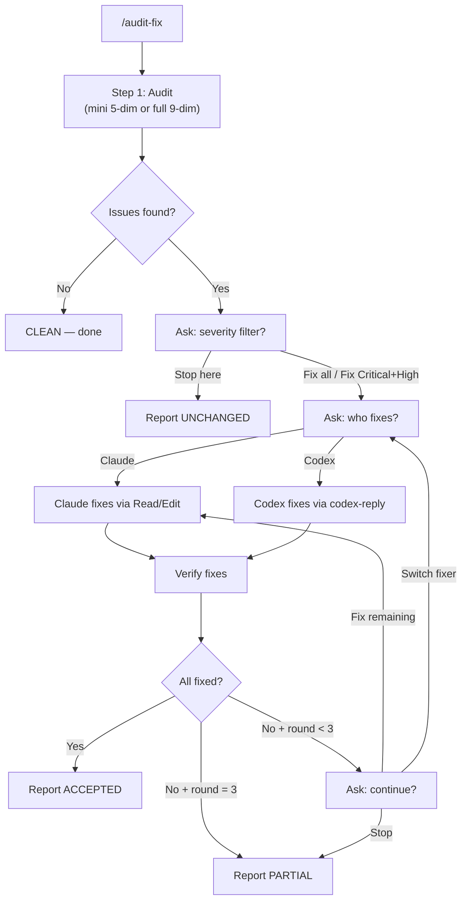
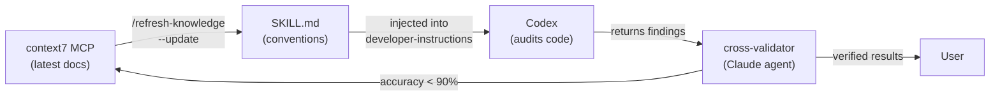
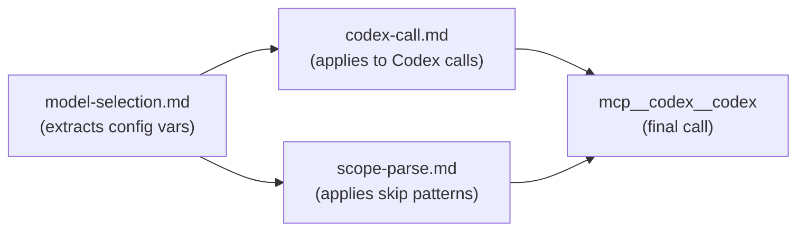
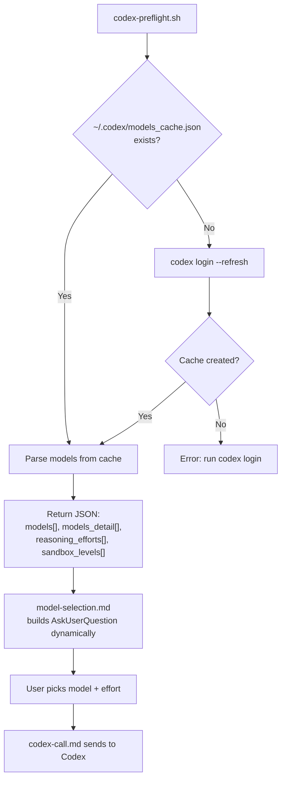
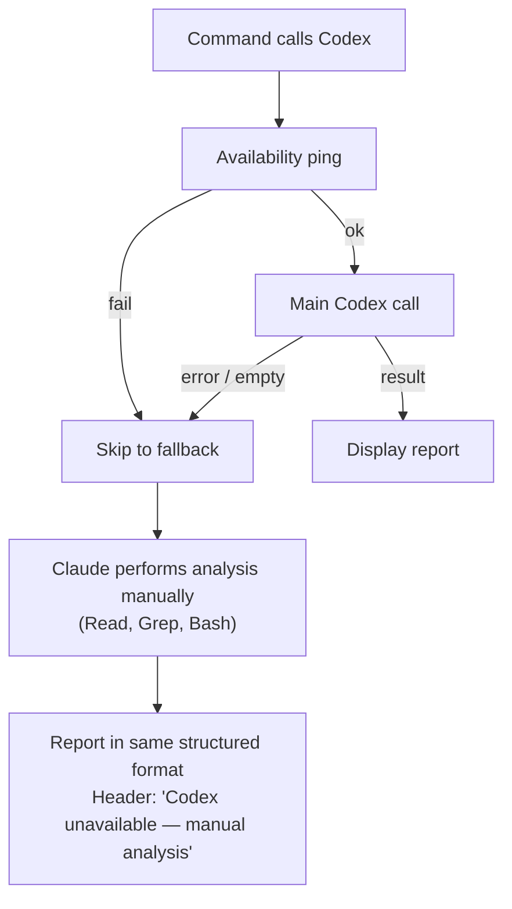

# codex-toolkit Guide

Comprehensive reference for the codex-toolkit plugin — every feature, workflow, and architectural decision explained.

## Table of Contents

- [Architecture Overview](#architecture-overview)
- [Installation & Setup](#installation--setup)
- [Commands Reference](#commands-reference)
- [Background Execution](#background-execution)
- [Job State Management](#job-state-management)
- [Session Lifecycle](#session-lifecycle)
- [Stop-Time Review Gate](#stop-time-review-gate)
- [Audit→Fix→Verify Workflow](#auditfixverify-workflow)
- [Structured Output Schema](#structured-output-schema)
- [Cross-Provider Knowledge Architecture](#cross-provider-knowledge-architecture)
- [Project Configuration](#project-configuration)
- [Model Discovery](#model-discovery)
- [Fallback Behavior](#fallback-behavior)
- [Testing](#testing)
- [Troubleshooting](#troubleshooting)

---

## Architecture Overview

codex-toolkit bridges two AI systems: Claude Code (Anthropic) runs as the orchestrator, while Codex (OpenAI) runs as an autonomous worker via MCP. The plugin adds a scripts layer for job tracking, lifecycle management, and background execution.



### Integration Modes

| Mode | Transport | When used | Behavior |
|------|-----------|-----------|----------|
| Foreground (MCP) | `mcp__codex__codex` tool | Default (`--wait`) | Claude calls Codex inline, blocks until complete |
| Background (CLI) | `codex exec` via detached process | `--background` flag | Returns job ID immediately, stores result on disk |

Both modes track jobs in the persistent state directory.

### Component Inventory

| Layer | Files | Purpose |
|-------|-------|---------|
| Commands | 20 user-invocable + 5 shared partials | Prompt-based workflows with YAML frontmatter |
| Agents | 1 (`cross-validator.md`) | Cross-validate Codex findings against Claude's knowledge |
| Skills | 1 (`claude-code-conventions`) | Canonical Claude Code schemas injected into Codex |
| Scripts | 6 lib modules + 3 entry points | Job state, process mgmt, rendering, background runner, hooks |
| Hooks | `hooks.json` | SessionStart, SessionEnd, Stop |
| Schemas | `audit-output.schema.json` | Structured audit output contract |
| Tests | 7 test files (52 tests) | State, jobs, process, render, commands, workspace |

---

## Installation & Setup

### Prerequisites

| Requirement | Minimum | Check |
|-------------|---------|-------|
| Node.js | 18.18+ | `node --version` |
| Codex CLI | latest | `codex --version` |
| Auth | ChatGPT subscription or API key | `codex login status` |

```bash
npm install -g @openai/codex
codex login
```

### Install the plugin

```bash
# Add marketplace (once)
/plugin marketplace add xiaolai/claude-plugin-marketplace

# Install
/plugin install codex-toolkit@xiaolai
```

| Scope | Flag | Effect |
|-------|------|--------|
| User (default) | — | Available in all projects |
| Project | `--scope project` | Shared with team via `.claude/settings.json` |
| Local | `--scope local` | Only you, only this repo |

### Verify installation

```bash
/codex-toolkit:setup       # readiness check
/codex-toolkit:preflight   # model discovery
```

### First run

```bash
/codex-toolkit:audit --mini    # quick 5-dimension audit of uncommitted changes
```

---

## Commands Reference

### Core Commands

| Command | Description | Background | Sandbox |
|---------|-------------|:----------:|---------|
| `/audit` | Code audit — 5-dim `--mini` or 9-dim `--full` | `--background` | read-only |
| `/implement` | Delegate plan to Codex for autonomous execution | `--background` | user-chosen |
| `/bug-analyze` | Root cause analysis for user-described bugs | `--background` | read-only |
| `/review-plan` | Architectural review (5 dimensions) | `--background` | read-only |
| `/verify` | Verify fixes from a previous audit report | — | read-only |
| `/audit-fix` | Audit→fix→verify loop (up to 3 rounds) | — | user-chosen |
| `/continue` | Follow up on a previous Codex session via thread ID | — | — |

#### `/audit` Dimensions

| Dimension | Mini | Full | Focus |
|-----------|:----:|:----:|-------|
| 1. Logic & Correctness | x | x | Race conditions, edge cases, async issues |
| 2. Duplication | x | x | Copy-paste code, DRY violations |
| 3. Dead Code | x | x | Unused imports, unreachable branches |
| 4. Refactoring Debt | x | x | Long functions, deep nesting, unclear names |
| 5. Shortcuts & Patches | x | x | TODOs, hardcoded values, workarounds |
| 6. Security & Risk | — | x | Injection, secrets, auth, crypto |
| 7. Performance & Efficiency | — | x | Algorithm complexity, N+1 queries, blocking I/O |
| 8. Dependencies & Environment | — | x | CVEs, outdated packages, config security |
| 9. Documentation | — | x | Missing docs, outdated comments |

#### `/review-plan` Dimensions

| Dimension | Focus |
|-----------|-------|
| 1. Internal Consistency | Contradicting decisions, data model mismatches |
| 2. Completeness | Missing error paths, edge cases, migration |
| 3. Feasibility | API correctness, technology mismatches, performance assumptions |
| 4. Ambiguity | Vague specs, undefined behavior, multiple interpretations |
| 5. Risk & Sequencing | High-risk items buried late, dependency ordering |

#### `/bug-analyze` Analysis Layers

| Layer | Focus |
|-------|-------|
| Logic Flow | Execution path tracing, conditional branches, boundary issues |
| State Management | Race conditions, stale state, async/await issues |
| Data Flow | Type coercion, null propagation, truncation |
| Error Handling | Swallowed exceptions, incomplete cleanup |
| Edge Cases | Empty inputs, zero values, concurrency, resource exhaustion |

### Specialized Audit Commands

| Command | Target | Mini Pillars | Full Pillars |
|---------|--------|:------------:|:------------:|
| `/audit-plugin` | Plugin directories | 4 | 7 |
| `/audit-skill` | SKILL.md files | 4 | 7 |
| `/audit-command` | Slash command files | 4 | 7 |
| `/audit-rules` | .claude/rules/ | 4 | 7 |
| `/audit-agent` | Agent definitions | 4 | 7 |
| `/audit-nlp` | All NL artifacts in repo | 5 categories | all pillars |

#### Pillar Breakdown (per audit type)

| # | audit-plugin | audit-skill | audit-command | audit-rules | audit-agent |
|---|-------------|-------------|---------------|-------------|-------------|
| 0 | YAML Schema | Frontmatter Schema | Frontmatter Schema | Schema & Formatting | Frontmatter Schema |
| 1 | Spec Quality | Description Quality | Workflow Clarity | Enforceability | Triggering Quality |
| 2 | *Security Posture* | Content Structure | Tool Selection | Token Budget | System Prompt Quality |
| 3 | Structural Integrity | Context Efficiency | Output Specification | Conflict Detection | Tool Selection |
| 4 | *Behavioral Consistency* | *Scope Boundaries* | *Error Handling* | *Path Scoping* | *Scope & Boundaries* |
| 5 | *Robustness & Edge Cases* | *Cross-References* | *Argument Safety* | *Tooling Overlap* | *Output Specification* |
| 6 | Maintainability | *Actionability* | *Shared Partial Usage* | *Staleness & Relevance* | *Safety & Trust* |

*Italics = full audit only*

### Job Management Commands

| Command | Description | Input |
|---------|-------------|-------|
| `/status` | Show active/recent jobs, review gate status | `[job-id] [--all]` |
| `/result` | Fetch stored output from completed job | `[job-id]` |
| `/cancel` | Cancel a running background job | `[job-id]` |

### Configuration Commands

| Command | Description | Input |
|---------|-------------|-------|
| `/setup` | Check readiness, manage review gate | `[--enable-review-gate \| --disable-review-gate]` |
| `/init` | Generate `.codex-toolkit.md` project config | interactive wizard |
| `/preflight` | Check connectivity, discover available models | — |
| `/refresh-knowledge` | Update Claude Code conventions from context7 | `[--check \| --update]` |

> When installed as a plugin, commands appear as `/codex-toolkit:<command>`.

---

## Background Execution

### Supported Commands

| Command | Default Mode | `--background` | `--wait` |
|---------|:------------:|:--------------:|:--------:|
| `/audit` | foreground | returns job ID | explicit foreground |
| `/implement` | foreground | returns job ID | explicit foreground |
| `/bug-analyze` | foreground | returns job ID | explicit foreground |
| `/review-plan` | foreground | returns job ID | explicit foreground |

### Execution Flow



### Job ID Prefix Matching

All job management commands support prefix matching:

| Full ID | Valid prefixes | Invalid (ambiguous) |
|---------|---------------|---------------------|
| `audit-m1a2b3-xyz789` | `audit-m1a`, `audit-m1a2b3` | `audit-` (if multiple audit jobs) |

---

## Job State Management

### State Directory Layout

```
$CLAUDE_PLUGIN_DATA/state/<workspace-slug>-<hash>/
├── state.json           # job list (max 50) + config
└── jobs/
    ├── <job-id>.json    # result payload
    └── <job-id>.log     # progress log
```

Fallback: `$TMPDIR/codex-toolkit/` if `$CLAUDE_PLUGIN_DATA` is unset.

### Job Lifecycle



### Job Record Fields

| Field | Type | Description |
|-------|------|-------------|
| `id` | string | Unique identifier (e.g., `audit-m1a2b3-xyz`) |
| `kind` | string | Command type: `audit`, `implement`, `bug-analyze`, `review-plan`, `verify` |
| `status` | enum | `queued` / `running` / `completed` / `failed` / `cancelled` |
| `summary` | string | Brief description of the task |
| `sessionId` | string | Claude Code session that created this job |
| `pid` | number | OS process ID (for cancellation) |
| `threadId` | string | Codex thread ID (for `/continue` follow-up) |
| `startedAt` | ISO 8601 | When execution started |
| `completedAt` | ISO 8601 | When execution finished |
| `logFile` | path | Progress log file location |
| `errorMessage` | string | Error details (if failed) |

### Pruning Rules

| Condition | Action |
|-----------|--------|
| Job count > 50 | Oldest jobs (by `updatedAt`) pruned |
| Job pruned | Result `.json` and `.log` files deleted |
| Session ends | All session jobs removed (SessionEnd hook) |

### Session Filtering

| Command | Default filter | Override |
|---------|----------------|----------|
| `/status` | Current session only | `--all` for all sessions |
| `/result` | Current session (no ref) / all (with ref) | — |
| `/cancel` | All sessions | — |

---

## Session Lifecycle



### Hook Configuration

| Hook | Script | Timeout | Purpose |
|------|--------|--------:|---------|
| SessionStart | `session-lifecycle-hook.mjs SessionStart` | 5s | Assign session ID, persist env vars |
| SessionEnd | `session-lifecycle-hook.mjs SessionEnd` | 5s | Kill orphans, clean up state |
| Stop | `stop-review-gate-hook.mjs` | 900s | Optional adversarial review gate |

---

## Stop-Time Review Gate

An optional hook that runs a Codex adversarial review when Claude's session is about to end.

### Gate Flow



### Gate Configuration

| Action | Command |
|--------|---------|
| Enable | `/codex-toolkit:setup --enable-review-gate` |
| Disable | `/codex-toolkit:setup --disable-review-gate` |
| Check | `/codex-toolkit:setup` |

Configuration is persisted in `state.json → config.stopReviewGate`.

### Gate Behavior

| Scenario | Result |
|----------|--------|
| Gate disabled | Session ends normally, no review |
| Codex not available | Gate silently skipped |
| Review returns `ALLOW:` | Session ends normally |
| Review returns `BLOCK:` | Session blocked, reason displayed |
| Review times out (>15min) | Session blocked, suggest manual review |
| Review errors | Session blocked, suggest manual review |
| Background job still running | Warning appended regardless of gate |

### When to Use

| Use case | Recommended |
|----------|:-----------:|
| Critical codebase, pre-deploy | Yes |
| Pair programming with AI | Yes |
| Rapid prototyping | No |
| Casual exploration | No |

Cost: 1-5 minutes + Codex API credits per session end.

---

## Audit→Fix→Verify Workflow

### Cycle Flow



### Decision Points

| Step | Options | Default |
|------|---------|---------|
| Audit type | `--full` (9-dim) / `--mini` (5-dim) | mini |
| Severity filter | All / Critical+High / Stop | All |
| Fixer | Claude (direct edits) / Codex (sandboxed) | Claude |
| After round | Fix remaining / Switch fixer / Stop | Fix remaining |

### Thread Reuse Strategy

| Fixer | Verify method | Thread |
|-------|---------------|--------|
| Codex | Continue same thread via `codex-reply` | Reused (cumulative context) |
| Claude | Fresh Codex call for independent verification | New |
| Either | Thread expired | Fallback to fresh call |

### Verdicts

| Verdict | Condition |
|---------|-----------|
| ACCEPTED | All issues fixed, verification passed |
| PARTIAL | Some issues fixed, some remain after max rounds |
| UNCHANGED | User stopped before fixing, or nothing fixable |

---

## Structured Output Schema

`schemas/audit-output.schema.json` defines the contract for structured audit output.

### Schema Fields

| Field | Type | Required | Description |
|-------|------|:--------:|-------------|
| `verdict` | enum | Yes | `clean` / `needs-attention` / `needs-work` / `blocked` |
| `summary` | string | Yes | Executive summary of findings |
| `findings` | array | Yes | List of individual findings |
| `next_steps` | string[] | Yes | Recommended actions |
| `audit_type` | enum | No | `mini` or `full` |
| `scope` | string | No | What was audited |
| `model` | string | No | Codex model used |
| `thread_id` | string | No | Thread ID for `/continue` |
| `dimension_summary` | array | No | Per-dimension severity counts |

### Finding Fields

| Field | Type | Required | Description |
|-------|------|:--------:|-------------|
| `severity` | enum | Yes | `critical` / `high` / `medium` / `low` |
| `title` | string | Yes | Short description |
| `body` | string | Yes | Detailed explanation |
| `file` | string | Yes | File path |
| `dimension` | integer | Yes | Audit dimension (1-9) |
| `line_start` | integer | No | Start line number |
| `line_end` | integer | No | End line number |
| `confidence` | float | No | Auditor confidence (0.0-1.0) |
| `recommendation` | string | No | Suggested fix |

### Example

```json
{
  "verdict": "needs-attention",
  "summary": "Found 5 issues across 3 dimensions",
  "audit_type": "mini",
  "findings": [
    {
      "severity": "high",
      "title": "Race condition in WebSocket handler",
      "body": "Concurrent access to shared state without locking",
      "file": "src/ws.ts",
      "line_start": 42,
      "line_end": 58,
      "dimension": 1,
      "confidence": 0.9,
      "recommendation": "Use a mutex or channel for state access"
    }
  ],
  "dimension_summary": [
    { "dimension": 1, "name": "Logic & Correctness", "critical": 0, "high": 1, "medium": 2, "low": 0 }
  ],
  "next_steps": ["Fix the high-severity race condition first", "Run /verify to confirm fixes"]
}
```

---

## Cross-Provider Knowledge Architecture

Codex (OpenAI) has zero native knowledge of Claude Code conventions. The plugin bridges this gap with three layers.

### Knowledge Flow



### Three Layers

| Layer | Component | Trigger | Purpose |
|-------|-----------|---------|---------|
| 1. Knowledge Skill | `claude-code-conventions/SKILL.md` | Every plugin-audit command | Inject Claude Code schemas into Codex |
| 2. Knowledge Refresh | `/refresh-knowledge` | Manual (`--check` / `--update`) | Sync skill with latest official docs |
| 3. Cross-Validation | `cross-validator` agent | After audit commands | Catch false positives, hallucinated conventions |

### Knowledge Skill Contents

| Schema | Coverage |
|--------|----------|
| `plugin.json` | name (required), version, description |
| Command frontmatter | description, argument-hint, allowed-tools, model, user-invocable |
| Agent frontmatter | description + examples, model, color, tools, skills |
| Skill frontmatter | name, description, version, globs |
| Hook events | 10 types (PreToolUse, PostToolUse, Stop, SessionStart, etc.) |
| `hooks.json` | Hook structure, type, command, timeout |
| `.mcp.json` | Server registration format |
| `marketplace.json` | Plugin listing format |
| Naming | kebab-case throughout |
| Settings hierarchy | plugin defaults → global user → project → local |

---

## Project Configuration

### `.codex-toolkit.md` Structure

| Section | Variables extracted | Used by |
|---------|-------------------|---------|
| Project | Stack, test command, source dirs | informational |
| Defaults | `{config_default_model}`, `{config_default_effort}`, `{config_default_sandbox}`, `{config_default_audit_type}` | `model-selection.md` |
| Audit Focus | `{config_focus_instructions}` | `codex-call.md` (appended to developer-instructions) |
| Skip Patterns | `{config_skip_patterns}` | `scope-parse.md` (glob filter) |
| Project-Specific Instructions | `{config_project_instructions}` | `codex-call.md` (appended to developer-instructions) |

### Configuration Priority

| Priority | Source | Example |
|:--------:|--------|---------|
| 1 (highest) | User's explicit choice (AskUserQuestion) | User picks "high" effort |
| 2 | Project config (`.codex-toolkit.md`) | Config says `medium` |
| 3 (lowest) | Command's built-in default | Command defaults to `low` |

### Config Enforcement Chain



---

## Model Discovery

Models are discovered dynamically — zero hardcoded model names.

### Discovery Flow



### Caching

| Cache | Location | TTL | Bypass |
|-------|----------|:---:|--------|
| Models cache | `~/.codex/models_cache.json` | Managed by Codex CLI | `codex login --refresh` |
| Preflight cache | `$TMPDIR/codex-preflight-cache.json` | 5 minutes | `CODEX_PREFLIGHT_NO_CACHE=1` |

---

## Fallback Behavior



### Fallback Rules

| Rule | Enforcement |
|------|-------------|
| Never stop just because Codex failed | Every command has a fallback section |
| Cover all dimensions/criteria | Same depth as Codex-powered analysis |
| Same report format | Identical structure, identical fields |
| No retry | MCP errors are transient, not fixable by retrying |
| Report failure clearly | "Codex call failed: {error}. Falling back..." |
| Multi-step workflows | Report what completed, fall back for remainder |

---

## Testing

### Running Tests

```bash
cd codex-toolkit
npm test
```

Uses Node.js native test runner (`node --test`).

### Test Coverage

| Test File | Module | Tests | Key Scenarios |
|-----------|--------|:-----:|---------------|
| `state.test.mjs` | State CRUD | 10 | save/load round-trip, pruning at 50, config persistence |
| `job-control.test.mjs` | Job lifecycle | 11 | sorting, enrichment, snapshots, prefix matching, ambiguity |
| `process.test.mjs` | Process mgmt | 10 | command execution, binary detection, process termination |
| `render.test.mjs` | Output formatting | 10 | empty state, running jobs, findings tables, severity sorting |
| `commands.test.mjs` | Command validation | 9 | frontmatter, user-invocable, background flags, hooks, schema |
| `workspace.test.mjs` | Workspace detection | 2 | git root detection, non-git fallback |
| **Total** | | **52** | |

---

## Troubleshooting

| Problem | Cause | Fix |
|---------|-------|-----|
| "codex CLI not found" | Codex not installed | `npm install -g @openai/codex` |
| "Not authenticated" | No login session | `codex login` or set `OPENAI_API_KEY` |
| "No models available" | Stale models cache | `codex login --refresh` |
| Background job stuck | Process hung | `/codex-toolkit:cancel <job-id>` |
| Thread expired on `/continue` | MCP server restarted | Start fresh with the relevant command |
| Review gate keeps blocking | Gate too aggressive | `/codex-toolkit:setup --disable-review-gate` |
| Orphaned codex processes | Session crashed | `ps aux \| grep codex` then `kill <pid>` |
| Can't find state directory | Env var not set | Check `$CLAUDE_PLUGIN_DATA/state/` or `$TMPDIR/codex-toolkit/` |
