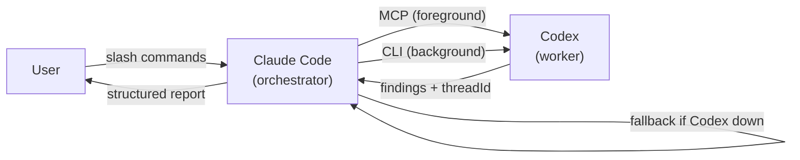

# codex-toolkit

OpenAI Codex MCP integration for Claude Code — audit, implement, verify, review, and debug via Codex.

Part of the [xiaolai plugin marketplace](https://github.com/xiaolai/claude-plugin-marketplace). For the full reference, see **[GUIDE.md](GUIDE.md)**.

## Install

```bash
npm install -g @openai/codex && codex login    # prerequisite
/plugin marketplace add xiaolai/claude-plugin-marketplace
/plugin install codex-toolkit@xiaolai
/codex-toolkit:setup                           # verify readiness
```

## How It Works



## Commands

### Core

| Command | Description | Background |
|---------|-------------|:----------:|
| `/audit` | Code audit — 5-dim `--mini` or 9-dim `--full` | `--background` |
| `/implement` | Delegate plan to Codex for autonomous execution | `--background` |
| `/bug-analyze` | Root cause analysis for user-described bugs | `--background` |
| `/review-plan` | Architectural review (consistency, feasibility, risk) | `--background` |
| `/verify` | Verify fixes from a previous audit | — |
| `/audit-fix` | Audit→fix→verify loop (up to 3 rounds) | — |
| `/continue` | Follow up on a previous Codex session via thread ID | — |

### Specialized Audits

| Command | Target | Pillars |
|---------|--------|:-------:|
| `/audit-plugin` | Plugin directories | 4 mini / 7 full |
| `/audit-skill` | SKILL.md files | 4 mini / 7 full |
| `/audit-command` | Slash command files | 4 mini / 7 full |
| `/audit-rules` | .claude/rules/ | 4 mini / 7 full |
| `/audit-agent` | Agent definitions | 4 mini / 7 full |
| `/audit-nlp` | All NL artifacts in repo | 5 categories |

### Job Management

| Command | Description |
|---------|-------------|
| `/status` | Show active/recent jobs, review gate status |
| `/result` | Fetch stored output from completed job |
| `/cancel` | Cancel a running background job |

### Configuration

| Command | Description |
|---------|-------------|
| `/setup` | Check readiness, manage stop-time review gate |
| `/init` | Generate `.codex-toolkit.md` project config |
| `/preflight` | Check connectivity, discover available models |
| `/refresh-knowledge` | Update Claude Code conventions from context7 docs |

> When installed as a plugin, commands appear as `/codex-toolkit:<command>`.

## Quick Start

```bash
/codex-toolkit:audit --mini              # fast audit of uncommitted changes
/codex-toolkit:audit --full --background # thorough audit, don't wait
/codex-toolkit:status                    # check progress
/codex-toolkit:result                    # get results
/codex-toolkit:audit-fix                 # auto-fix cycle
```

## Key Features

| Feature | Description |
|---------|-------------|
| Background execution | `--background` flag on 4 commands. Returns job ID, poll with `/status`, fetch with `/result`. |
| Job state management | Persistent per-workspace state (50 jobs max), session-scoped filtering, prefix-match IDs. |
| Session lifecycle hooks | SessionStart assigns ID, SessionEnd kills orphaned processes and cleans state. |
| Stop-time review gate | Opt-in Stop hook runs Codex adversarial review before session end. ALLOW/BLOCK. |
| Structured output schema | JSON schema with per-finding `dimension`, `confidence`, `dimension_summary`. |
| Cross-provider knowledge | Injects Claude Code conventions into Codex, refreshes from context7, cross-validates. |
| Fallback | Every Codex command falls back to manual Claude analysis if Codex is unavailable. |
| Tests | 52 tests covering state, jobs, process, rendering, command validation. |

## codex-toolkit vs codex-plugin-cc (OpenAI)

| Capability | codex-toolkit | codex-plugin-cc |
|------------|:-------------:|:---------------:|
| Audit dimensions | 5 mini / 9 full | 1 (flat review) |
| Specialized artifact audits | 6 types | 0 |
| Audit→fix→verify loop | 3-round auto-cycle | — |
| Background execution | `--background` | `--background` |
| Job state management | 50 jobs, session-scoped | 50 jobs, session-scoped |
| Session lifecycle hooks | SessionStart + SessionEnd | SessionStart + SessionEnd |
| Stop-time review gate | Codex adversarial review | Codex adversarial review |
| Cross-provider knowledge | skill injection + refresh + validation | N/A (same ecosystem) |
| Fallback when Codex down | full manual analysis via Claude | fails |
| Project config | `.codex-toolkit.md` | `.codex/config.toml` |
| Structured output schema | dimension + confidence | confidence |
| Progressive disclosure | mini → full → specialized | single mode |
| Adversarial review | via review gate | `/adversarial-review` command |
| Task delegation | `/implement` (plan-based) | `/rescue` (free-form) |
| Thread resume | `/continue <threadId>` | `--resume` / `--fresh` |
| Transport | MCP + CLI | JSON-RPC app-server + TCP broker |
| Tests | 52 | 50+ |
| Total commands | 20 + 5 partials | 7 + 3 skills |
| Scripts layer | ~600 LOC | ~3,200 LOC |

### In Short

**codex-toolkit** — multi-dimensional auditing platform. Deep structured analysis, progressive disclosure (mini → full → specialized), automated fix cycles, cross-provider knowledge bridge.

**codex-plugin-cc** — focused Codex bridge. Mature runtime (app-server protocol, TCP broker, progress streaming), polished job UX, adversarial review command.

Both share: persistent job state, background execution, session lifecycle hooks, stop-time review gates.

## MCP Server

The plugin registers Codex as an MCP server via `.mcp.json`. Authenticate via subscription (`codex login`) or `OPENAI_API_KEY`.

## License

MIT
